# [G09 - Twice Treasured] Report

## Table of Contents

1. [Team Members and Roles](#team-members-and-roles)
2. [Summary of Individual Contributions](#summary-of-individual-contributions)
3. [Application Description](#application-description)
4. [Application UML](#application-uml)
5. [Application Design and Decisions](#Code Design and Decisions)
6. [Summary of Known Errors and Bugs](#summary-of-known-errors-and-bugs)
7. [Testing Summary](#testing-summary)
8. [Implemented Features](#implemented-features)
9. [Team Meetings](#Meetings Records)
10. [Conflict Resolution Protocol](#conflict-resolution-protocol)

## Administrative
- Firebase Repository Link: [Second Hand Market-Twice Treasured](https://console.firebase.google.com/project/second-hand-market-affd5/overview)
  
   - Confirm: I have already added comp21006442@gmail.com as a Developer to the Firebase project prior to due date.
   
     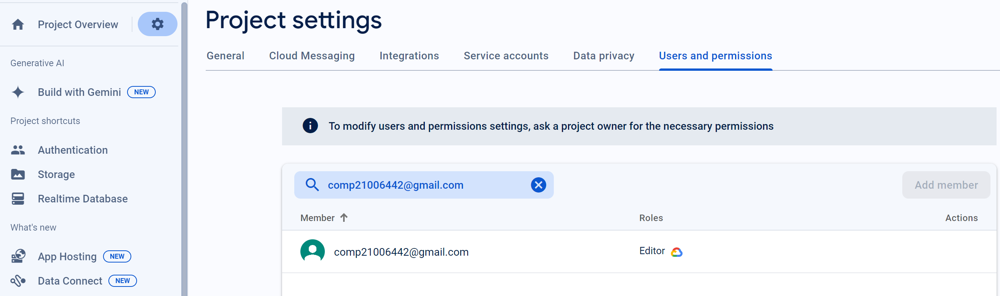
- Two user accounts for markers' access are usable on the app's APK (do not change the username and password unless there are exceptional circumstances. Note that they are not real e-mail addresses in use):
   - Username: comp2100@anu.edu.au	Password: comp2100
   
   - Username: comp6442@anu.edu.au	Password: comp6442
   
     
   
     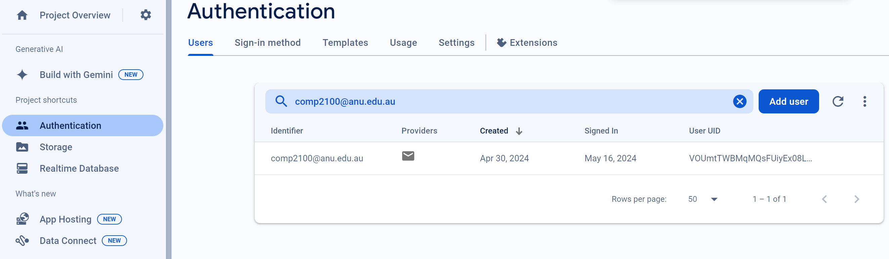
   
     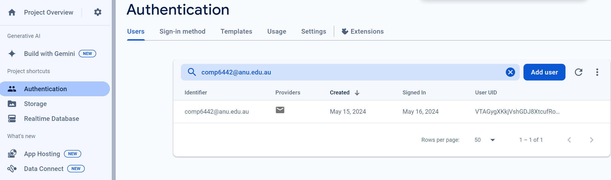
   
   

## Team Members and Roles
The key area(s) of responsibilities for each member

| UID      |            Name             |                                    Role |
| :------- | :-------------------------: | --------------------------------------: |
| u7756873 |         Lingjie Qin         | Full stack developer, Tester, Supporter |
| u7303997 | Scott Ferrageau de St Amand | Full stack developer, Tester, Supporter |
| u7642453 |         Wanzhong Wu         | Full stack developer, Tester, Supporter |
| u7706423 |           Wen Li            | Full stack developer, Tester, Supporter |
| u7769944 |        Xiaojie Zhou         | Full stack developer, Tester, Supporter |


## Summary of Individual Contributions

1.**u7756873, Lingjie Qin**  I have <u>20.6%</u> contribution, as follows: 

- **Code Contribution in the final App**
  - Feature
    - Basic Features 4 [DataStream] - [Post.java](https://gitlab.cecs.anu.edu.au/u7706423/gp-24s1/-/blob/main/src/app/src/main/java/com/example/myapplication/Activities/Post.java)
    - Basic Features 5 [Search] - [SearchService.java](https://gitlab.cecs.anu.edu.au/u7706423/gp-24s1/-/blob/main/src/app/src/main/java/com/example/myapplication/Activities/SearchService.java)
    - S2 Search-Filter - [SearchResultPage.java](https://gitlab.cecs.anu.edu.au/u7706423/gp-24s1/-/blob/main/src/app/src/main/java/com/example/myapplication/Activities/SearchResultPage.java)
- **Code and App Design** 
  - Data Structure
    - AVLTree - [inOrderTraversalAscending, inOrderTraversalDescending](https://gitlab.cecs.anu.edu.au/u7706423/gp-24s1/-/blob/main/src/app/src/main/java/com/example/myapplication/common/AVLTree.java#L216-234)
- **Others**
  - APP display video
  - Test: [TokenTest.java](https://gitlab.cecs.anu.edu.au/u7706423/gp-24s1/-/blob/main/src/app/src/test/java/com/example/myapplication/TokenTest.java), [AVLTreeTest.java](https://gitlab.cecs.anu.edu.au/u7706423/gp-24s1/-/blob/main/src/app/src/test/java/com/example/myapplication/AVLTreeTest.java)
  - Meeting-0416 Lead and scribe

2.**u7303997, Scott Ferrageau de St Amand** I have <u>16.8%</u> contribution, as follows: 

- **Code Contribution in the final App**
  - Feature
    -  [P2P-DM] – [PrivateChat.java]( https://gitlab.cecs.anu.edu.au/u7706423/gp-24s1/-/blob/main/src/app/src/main/java/com/example/myapplication/Activities/PrivateChat.java), [MessageAdapter.java]( https://gitlab.cecs.anu.edu.au/u7706423/gp-24s1/-/blob/main/src/app/src/main/java/com/example/myapplication/Adapters/MessageAdapter.java), [PrivateMenuActivity.java]( https://gitlab.cecs.anu.edu.au/u7706423/gp-24s1/-/blob/main/src/app/src/main/java/com/example/myapplication/Activities/PrivateMenuActivity.java), [ChatMenuAdapter.java]( https://gitlab.cecs.anu.edu.au/u7706423/gp-24s1/-/blob/main/src/app/src/main/java/com/example/myapplication/Adapters/ChatMenuAdapter.java), [MesageBuble.java]( https://gitlab.cecs.anu.edu.au/u7706423/gp-24s1/-/blob/main/src/app/src/main/java/com/example/myapplication/basicClass/MessageBuble.java), [MessageEnvironment.java]( https://gitlab.cecs.anu.edu.au/u7706423/gp-24s1/-/blob/main/src/app/src/main/java/com/example/myapplication/basicClass/MessageEnvironment.java)
    - [FB-Persist-Extension] – [PrivateChat.java: lines 164-177, ValueEventListener() and addValue EventListener]( https://gitlab.cecs.anu.edu.au/u7706423/gp-24s1/-/blob/main/src/app/src/main/java/com/example/myapplication/Activities/PrivateChat.java#L164-177). [PrivateMenuActivity.java: lines 118-174, ValueEventListener() and addValueEventListener]( https://gitlab.cecs.anu.edu.au/u7706423/gp-24s1/-/blob/main/src/app/src/main/java/com/example/myapplication/Activities/PrivateMenuActivity.java#L118-177).
  - Other
    - [Commonhelper.java: getCurrentTimestamp()](https://gitlab.cecs.anu.edu.au/u7706423/gp-24s1/-/blob/main/src/app/src/main/java/com/example/myapplication/common/CommonHelper.java#L163-172)
    -  [ProductPage.java: chatWithSellerBtn.setOnClickListener()](https://gitlab.cecs.anu.edu.au/u7706423/gp-24s1/-/blob/main/src/app/src/main/java/com/example/myapplication/Activities/ProductPage.java#L67-81)
    - [User.java: addMessageId()](https://gitlab.cecs.anu.edu.au/u7706423/gp-24s1/-/blob/main/src/app/src/main/java/com/example/myapplication/basicClass/User.java#L81-84)
    - Test: [ChatMenuAdapterTest.java]( https://gitlab.cecs.anu.edu.au/u7706423/gp-24s1/-/blob/main/src/app/src/test/java/com/example/myapplication/ChatMenuAdapterTest.java), [MessageAdapterTest.java]( https://gitlab.cecs.anu.edu.au/u7706423/gp-24s1/-/blob/main/src/app/src/test/java/com/example/myapplication/MessageAdapterTest.java), [MessageBubbleTest.java]( https://gitlab.cecs.anu.edu.au/u7706423/gp-24s1/-/blob/main/src/app/src/test/java/com/example/myapplication/MessageBubbleTest.java), [MessageEnvironmentTest.java]( https://gitlab.cecs.anu.edu.au/u7706423/gp-24s1/-/blob/main/src/app/src/test/java/com/example/myapplication/MessageEnvironmentTest.java)
- **Code and App Design** 
  - UI Design
    - Used [RecyclerView]( https://gitlab.cecs.anu.edu.au/u7706423/gp-24s1/-/blob/main/src/app/src/main/res/layout/chat_menu_recycler.xml) to display messages and menu items.
    - Created two separate ViewHolders to display the messages in the private chat. The view holder displayed by the recycler changes depending on if the message is received or sent. See [message_recycler_send.xml]( https://gitlab.cecs.anu.edu.au/u7706423/gp-24s1/-/blob/main/src/app/src/main/res/layout/message_recycler_send.xml) and [message_recycler_received.xml]( https://gitlab.cecs.anu.edu.au/u7706423/gp-24s1/-/blob/main/src/app/src/main/res/layout/messsage_recycler_receive.xml).
    - Used relative layout for [activity_private_chat.xml]( https://gitlab.cecs.anu.edu.au/u7706423/gp-24s1/-/blob/main/src/app/src/main/res/layout/activity_private_chat.xml) and [activity_private_menu.xml](https://gitlab.cecs.anu.edu.au/u7706423/gp-24s1/-/blob/main/src/app/src/main/res/layout/activity_private_menu.xml) to have the activities compatible on multiple device sizes.
    - Added colours to [colors.xml]( https://gitlab.cecs.anu.edu.au/u7706423/gp-24s1/-/blob/main/src/app/src/main/res/values/colors.xml) to help with theme consistency across the app.
- **Others**
  - Report Writing: Authored [P2P-DM] and [FB-Persist-extension] sections.
  - Meeting-0506: Lead and scribe.

3.**u7642453, Wanzhong Wu** I have 21.4% contribution, as follows: 

- **Code Contribution in the final App**
  - Feature
    - B1 Login, F1 FB-Auth - [LoginPage.java](https://gitlab.cecs.anu.edu.au/u7706423/gp-24s1/-/blob/main/src/app/src/main/java/com/example/myapplication/Activities/LoginPage.java),[RegisterActivity.java](https://gitlab.cecs.anu.edu.au/u7706423/gp-24s1/-/blob/main/src/app/src/main/java/com/example/myapplication/Activities/RegisterActivity.java)
    - B5 Search, S1 Search-Invalid, S2 Search-Filter - [Token.java](https://gitlab.cecs.anu.edu.au/u7706423/gp-24s1/-/blob/main/src/app/src/main/java/com/example/myapplication/basicClass/Token.java),[Tokenizer.java](https://gitlab.cecs.anu.edu.au/u7706423/gp-24s1/-/blob/main/src/app/src/main/java/com/example/myapplication/basicClass/Tokenizer.java),[Parser.java](https://gitlab.cecs.anu.edu.au/u7706423/gp-24s1/-/blob/main/src/app/src/main/java/com/example/myapplication/basicClass/Parser.java)
    - B3 LoadShowData, B4 DataStream -[Post.java](https://gitlab.cecs.anu.edu.au/u7706423/gp-24s1/-/blob/main/src/app/src/main/java/com/example/myapplication/Activities/Post.java)
    - FB-Persist - [build.gradle.kts](https://gitlab.cecs.anu.edu.au/u7706423/gp-24s1/-/blob/main/src/app/build.gradle.kts?ref_type=heads)
- **Others**
  - APK packaging
  - Create report slide
  - Setup environment, connect firebase
  - Design database
  - Meeting-0415,0429: Lead and scribe.

4.**u7706423, Wen Li** I have <u>21.2%</u> contribution, as follows: 

- **Code Contribution in the final App**
  - Feature
    - G2 Data-Profile - [UserDetailPage.java](https://gitlab.cecs.anu.edu.au/u7706423/gp-24s1/-/blob/main/src/app/src/main/java/com/example/myapplication/Activities/UserDetailPage.java)
    - G3 Data-GPS  - [getLocation()](https://gitlab.cecs.anu.edu.au/u7706423/gp-24s1/-/blob/main/src/app/src/main/java/com/example/myapplication/Activities/UserDetailPage.java?#L285-331)
    - U4 Interact-Noti - [UserNotice.java](https://gitlab.cecs.anu.edu.au/u7706423/gp-24s1/-/blob/main/src/app/src/main/java/com/example/myapplication/basicClass/UserNotice.java), [FavoriteNotice.java](https://gitlab.cecs.anu.edu.au/u7706423/gp-24s1/-/blob/main/src/app/src/main/java/com/example/myapplication/basicClass/FavoriteNotice.java)
  - Design Pattern
    - Singleton - [Database.java](https://gitlab.cecs.anu.edu.au/u7706423/gp-24s1/-/blob/main/src/app/src/main/java/com/example/myapplication/basicClass/Database.java)
    - State - [UserState.java](https://gitlab.cecs.anu.edu.au/u7706423/gp-24s1/-/blob/main/src/app/src/main/java/com/example/myapplication/basicClass/UserState.java), [UserLoggedInState.java](https://gitlab.cecs.anu.edu.au/u7706423/gp-24s1/-/blob/main/src/app/src/main/java/com/example/myapplication/basicClass/UserLoggedInState.java), [UserLoggedOutState.java](https://gitlab.cecs.anu.edu.au/u7706423/gp-24s1/-/blob/main/src/app/src/main/java/com/example/myapplication/basicClass/UserLoggedOutState.java)
    - Factory Method - [Notice.java](https://gitlab.cecs.anu.edu.au/u7706423/gp-24s1/-/blob/main/src/app/src/main/java/com/example/myapplication/basicClass/Notice.java), [NoticeFactory.java](https://gitlab.cecs.anu.edu.au/u7706423/gp-24s1/-/blob/main/src/app/src/main/java/com/example/myapplication/basicClass/NoticeFactory.java) , [UserNotice.java](https://gitlab.cecs.anu.edu.au/u7706423/gp-24s1/-/blob/main/src/app/src/main/java/com/example/myapplication/basicClass/UserNotice.java), [FavoriteNotice.java](https://gitlab.cecs.anu.edu.au/u7706423/gp-24s1/-/blob/main/src/app/src/main/java/com/example/myapplication/basicClass/FavoriteNotice.java)
  - Other
    - [CommonHelper.java](https://gitlab.cecs.anu.edu.au/u7706423/gp-24s1/-/blob/main/src/app/src/main/java/com/example/myapplication/common/CommonHelper.java): showAlertDialog(), refreshLoginUser(), getLastLocation()
    - [GlobalVariables.java](https://gitlab.cecs.anu.edu.au/u7706423/gp-24s1/-/blob/main/src/app/src/main/java/com/example/myapplication/basicClass/GlobalVariables.java): Except isVisitorMode()
    - Test: [CategoryAdapterTest.java](https://gitlab.cecs.anu.edu.au/u7706423/gp-24s1/-/blob/main/src/app/src/test/java/com/example/myapplication/CategoryAdapterTest.java), [CategoryTest.java](https://gitlab.cecs.anu.edu.au/u7706423/gp-24s1/-/blob/main/src/app/src/test/java/com/example/myapplication/CategoryTest.java), [CommonHelperTest.java](https://gitlab.cecs.anu.edu.au/u7706423/gp-24s1/-/blob/main/src/app/src/test/java/com/example/myapplication/CommonHelperTest.java), [GlobalVariablesTest.java](https://gitlab.cecs.anu.edu.au/u7706423/gp-24s1/-/blob/main/src/app/src/test/java/com/example/myapplication/GlobalVariablesTest.java),[NoticeFactoryTest.java](https://gitlab.cecs.anu.edu.au/u7706423/gp-24s1/-/blob/main/src/app/src/test/java/com/example/myapplication/NoticeFactoryTest.java), [NotificationAdapterTest.java](https://gitlab.cecs.anu.edu.au/u7706423/gp-24s1/-/blob/main/src/app/src/test/java/com/example/myapplication/NotificationAdapterTest.java), [NotificationTest.java](https://gitlab.cecs.anu.edu.au/u7706423/gp-24s1/-/blob/main/src/app/src/test/java/com/example/myapplication/NotificationTest.java), [UserLoggedInStateTest.java](https://gitlab.cecs.anu.edu.au/u7706423/gp-24s1/-/blob/main/src/app/src/test/java/com/example/myapplication/UserLoggedInStateTest.java),[UserLoggedOutStateTest.java](https://gitlab.cecs.anu.edu.au/u7706423/gp-24s1/-/blob/main/src/app/src/test/java/com/example/myapplication/UserLoggedOutStateTest.java),[UserTest.java](https://gitlab.cecs.anu.edu.au/u7706423/gp-24s1/-/blob/main/src/app/src/test/java/com/example/myapplication/UserTest.java)
- **Code and App Design** 
  - Design Pattern: Singleton, State, Factory Method
  - UI Design
    - Use `RelativeLayout` and `ScrollView `to keep the top and bottom bars fixed while allowing the content to be scrollable for a smooth user experience.
    - Establish a custom `ViewHolder `and employ `CardView `to seamlessly display various layouts with different icons, encompassing `LinearLayout `and `GridLayout`.
- **Others**
  - Report Writing
  - Bug-fixing process for APK packaging
  - Meeting-0423 Lead and scribe

5.**u7769944, Xiaojie Zhou** I have <u>20%</u> contribution, as follows: <br>

- **Code Contribution in the final App**
  - Feature
    - DataFiles 2,500 valid data instances in the firebase ,you can also see the src/main/assets to find them
    - LoadShowData [Database.java](https://gitlab.cecs.anu.edu.au/u7706423/gp-24s1/-/blob/426017bae89d609e9e99b822e2c032ee09310a88/src/app/src/main/java/com/example/myapplication/basicClass/Database.java#L48-75)
    - AVLTree  finish basic methods. [AVLNode.java](https://gitlab.cecs.anu.edu.au/u7706423/gp-24s1/-/blob/426017bae89d609e9e99b822e2c032ee09310a88/src/app/src/main/java/com/example/myapplication/common/AVLNode.java#L1-70)[AVLTree.java](https://gitlab.cecs.anu.edu.au/u7706423/gp-24s1/-/blob/426017bae89d609e9e99b822e2c032ee09310a88/src/app/src/main/java/com/example/myapplication/common/AVLTree.java#L1-164)
    - U1 Interact-Micro [ProductPage.java](https://gitlab.cecs.anu.edu.au/u7706423/gp-24s1/-/blob/main/src/app/src/main/java/com/example/myapplication/Activities/ProductPage.java?ref_type=heads#L161-229)
    - U2 Interact-Follow [Favorite.java](https://gitlab.cecs.anu.edu.au/u7706423/gp-24s1/-/blob/main/src/app/src/main/java/com/example/myapplication/basicClass/Favorite.java?ref_type=heads#L1-61) [FavoriteAdapter.java](https://gitlab.cecs.anu.edu.au/u7706423/gp-24s1/-/blob/main/src/app/src/main/java/com/example/myapplication/Adapters/FavoriteAdapter.java?ref_type=heads#L1-274)[FavoritePage.java](https://gitlab.cecs.anu.edu.au/u7706423/gp-24s1/-/blob/main/src/app/src/main/java/com/example/myapplication/Activities/FavoritePage.java?ref_type=heads#L1-347)[IntroPage.java](https://gitlab.cecs.anu.edu.au/u7706423/gp-24s1/-/blob/426017bae89d609e9e99b822e2c032ee09310a88/src/app/src/main/java/com/example/myapplication/Activities/IntroPage.java#L27-29)
  - other
    - [ProductPage.java](https://gitlab.cecs.anu.edu.au/u7706423/gp-24s1/-/blob/426017bae89d609e9e99b822e2c032ee09310a88/src/app/src/main/java/com/example/myapplication/Activities/ProductPage.java#L1-158)
    - [ProductsManagePage.java](https://gitlab.cecs.anu.edu.au/u7706423/gp-24s1/-/blob/426017bae89d609e9e99b822e2c032ee09310a88/src/app/src/main/java/com/example/myapplication/Activities/ProductsManagePage.java#L1-97) [ProductsManageAdapter.java](https://gitlab.cecs.anu.edu.au/u7706423/gp-24s1/-/blob/426017bae89d609e9e99b822e2c032ee09310a88/src/app/src/main/java/com/example/myapplication/Adapters/ProductsManageAdapter.java#L1-115)[ProductEditorPage.java](https://gitlab.cecs.anu.edu.au/u7706423/gp-24s1/-/blob/426017bae89d609e9e99b822e2c032ee09310a88/src/app/src/main/java/com/example/myapplication/Activities/ProductEditorPage.java#L1-191)
    - [SearchItemAdapter.java](https://gitlab.cecs.anu.edu.au/u7706423/gp-24s1/-/blob/426017bae89d609e9e99b822e2c032ee09310a88/src/app/src/main/java/com/example/myapplication/Adapters/SearchItemAdapter.java#L1-103)
    - Test:[AVLNodeTest.java](https://gitlab.cecs.anu.edu.au/u7706423/gp-24s1/-/blob/426017bae89d609e9e99b822e2c032ee09310a88/src/app/src/test/java/com/example/myapplication/AVLNodeTest.java#L1-106) [AVLTreeTest.java](https://gitlab.cecs.anu.edu.au/u7706423/gp-24s1/-/blob/426017bae89d609e9e99b822e2c032ee09310a88/src/app/src/test/java/com/example/myapplication/AVLTreeTest.java#L113-170)[FavoriteTest.java](https://gitlab.cecs.anu.edu.au/u7706423/gp-24s1/-/blob/426017bae89d609e9e99b822e2c032ee09310a88/src/app/src/test/java/com/example/myapplication/FavoriteTest.java#L1-76)
- **Code and App Design** 
  - UI design: I completed the design and function implementation of the product details page, seller product management page, user collection list page, and UI design of the search results page.
- **Others**
  - Report Writing：Wen Li and I completed the writing of the entire report
  - Write two meeting records

## Application Description

**Twice Treasured** is a platform designed for buying and selling new and second-hand items. 

With Twice Treasured, users can:

- Browse and search for products of interest, and communicate with sellers anytime, anywhere.

- "Like" products to follow updates such as price drops or item delistings, ensuring they don't miss out on great deals.

- Upload and sell their own items, promoting the circulation of unused goods and supporting a sustainable second-hand market.

- Update their basic information.

  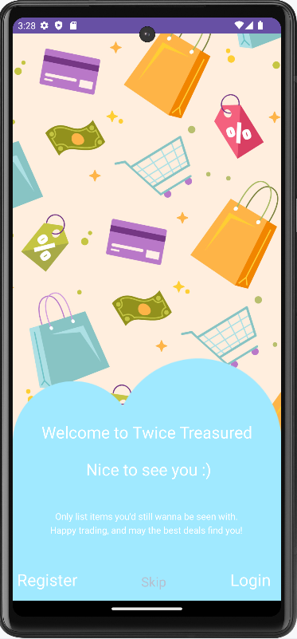

  

  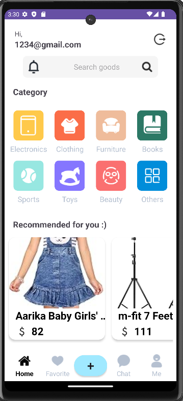
  
  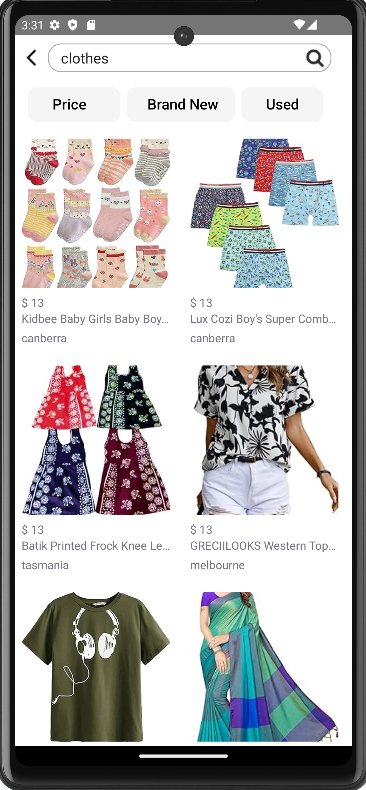
  
  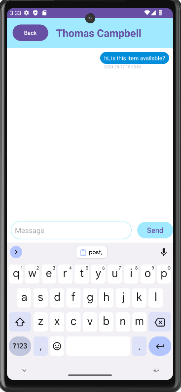
  
  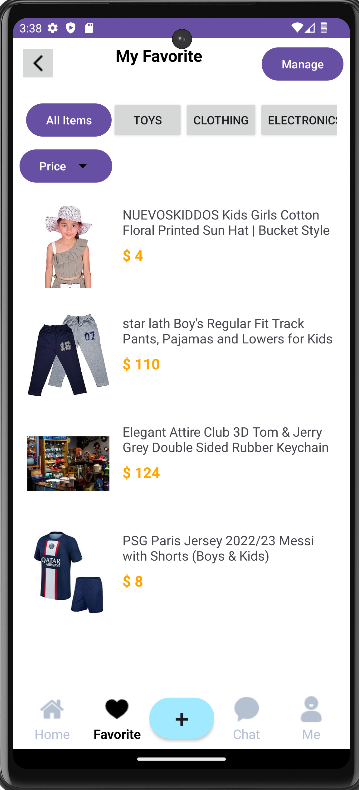
  
  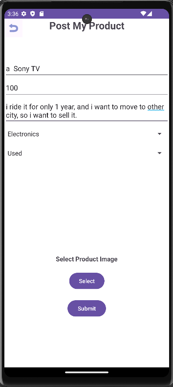
  
  *image:login,scan goods,search,chat,favorite,post(from top to bottom)*

### Application Use Cases and or Examples

**Browsing and Searching for Items**


- Lily wants to buy a new dress, so she opens Twice Treasured and **searches for** second-hand branded dresses.

**Communicating with Sellers and Favoriting Items**

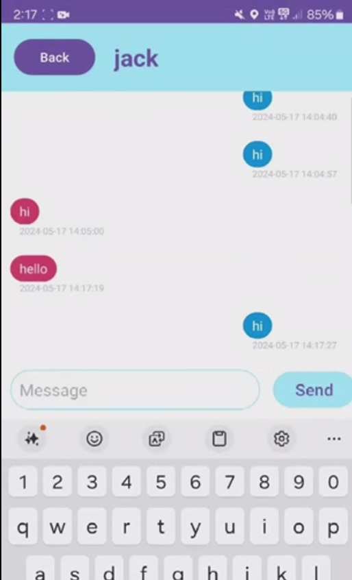

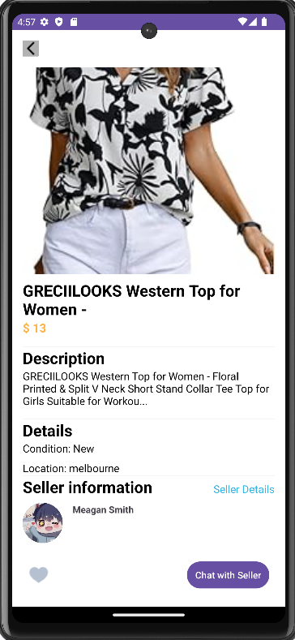

- Lily finds a dress she **likes** and clicks the product link to view the details. She thinks it’s great and uses the `Chat with Seller` feature in the bottom right corner to negotiate the price. 
- If Lily likes the item but wants to compare it with others, she can **click the heart icon** in the bottom left corner to favorite the item and easily find it later in her favorites list.

**Post Items for Sale**


- While preparing to move  home, Lily finds the TV she seldom use. She decides to list the TV for sale on Twice Treasured. 

**Notifications**

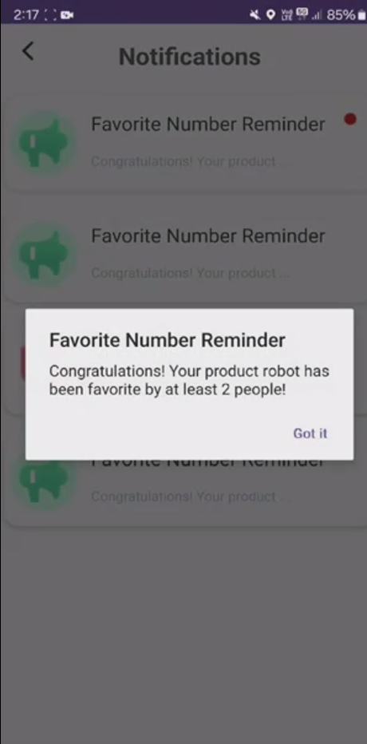

- Within a day, Lily receives a **notification** from the system that two users are interested in her item and have favorited it.

 **Managing and Modifying Items**


- A week passes and Lily’s dress hasn’t sold. She decides to lower the price to see if she can sell it more quickly.

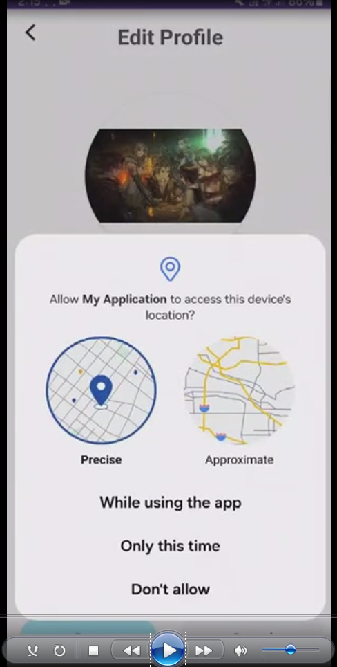

- After moving to a new place, Lily edits her profile and changes her **location, avatar, nickname** and other information.

<hr> 

### Application UML

***go to media/report/UML.png to see the clearer picture***

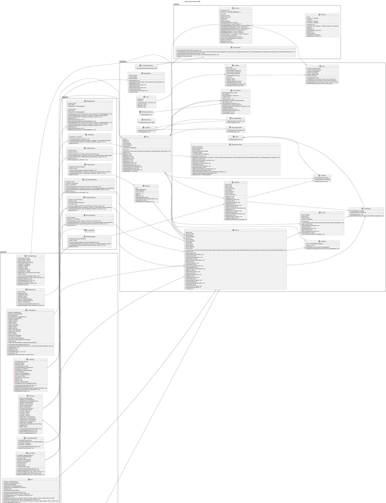

<hr>


## Code Design and Decisions

- **Details about the parser**

  Essentially, grammar functions by tracking` keywords `within user input. It's constructed from a combination of various filters working together. 

  This approach offers several benefits: it facilitates easier modifications in the future for enhancing the grammar, and it's both highly potent and straightforward to implement.

  ```
  <query> ::= <location-filter> <category-filter> <name-filter>
  <location-filter> ::= 'LOCATION' <string> | ε
  <category-filter> ::= 'CATEGORY' <string> | ε
  <name-filter> ::= 'NAME' <string> | ε
  <string> ::= [a-zA-Z0-9]+
  ```

- **Decisions made about data structure**

  utilizing the **AVLtree** data structure to compare products based on price, as it offers `efficiency ` for filtering. Each time a user initiates a search, the application will insert the product into the `AVLtree`, subsequently utilizing a parser to extract relevant data. This approach enables users to apply filters to display products in a `specific sequence` without the need to reload the database, thus greatly enhancing efficiency.

- **Details about the design patterns used** 

  - *Singleton*

    Singleton guarantees the creation of **only one database connection**, thus conserving resources effectively. By reusing this single connection, `system overhead is minimized`, resulting in faster operations. Moreover, Singleton ensures secure access to the connection, even in multi-threaded environments. This unified connection usage across all program components further guarantees `data consistency` throughout the application.

  - *State*

    User interface elements and functional restrictions can dynamically adapt `according to the user's login status`, thereby enhancing user experience and responsiveness. This **flexibility** allows for easy accommodation of changes and new requirements without disrupting the entire codebase.

  - *Factory Method*

    **New notice types can be added easily** without modifying existing code. By using factory interfaces instead of concrete classes, the design remains modular and loosely coupled, which facilitates system maintenance and evolution.

<hr>

### Data Structures

​	**1.AVLTree**

- The Parser class uses AVLTree to handle the filtering of product information, based on location, category and name tags.

* Code Locations: defined in [Class AVLTree](https://gitlab.cecs.anu.edu.au/u7706423/gp-24s1/-/blob/main/src/app/src/main/java/com/example/myapplication/common/AVLTree.java?ref_type=heads) ; processed using [Class Parser](https://gitlab.cecs.anu.edu.au/u7706423/gp-24s1/-/blob/main/src/app/src/main/java/com/example/myapplication/basicClass/Parser.java?ref_type=heads) and [Class SearchService](https://gitlab.cecs.anu.edu.au/u7706423/gp-24s1/-/blob/main/src/app/src/main/java/com/example/myapplication/Activities/SearchService.java?ref_type=heads)

* Reasons:
    * Searching product information by using an AVLTree is much more efficient than using a LinkedList. If there are N elements in the LinkedList, the worst case requires traversing the entire LinkedList, and the time complexity is O(n). But in AVLTree, the height of the tree is kept at O(log n) and the search operation can be very fast.
    * Complex query logic can be implemented efficiently by dynamically building and updating AVLTree in different parsing stages.
    * AVLTree naturally maintains the order of elements during their operations, which makes range queries and minimum/maximum query operations very efficient.
    
    **2.ArrayList**
    
    - `ArrayList` serves as a dynamic array that automatically adjusts its size, maintains insertion order, and allows efficient random access. It offers convenient methods for adding, removing, and searching elements, and automatically expands its capacity when needed. As it implements the `List` interface, it ensures compatibility with other collection framework classes and interfaces.
    - Code Location: processed using [UserDetail.users](https://gitlab.cecs.anu.edu.au/u7706423/gp-24s1/-/blob/main/src/app/src/main/java/com/example/myapplication/common/CommonHelper.java?ref_type=heads#L83), [NotificationAdapter.`notifications`](https://gitlab.cecs.anu.edu.au/u7706423/gp-24s1/-/blob/main/src/app/src/main/java/com/example/myapplication/Adapters/NotificationAdapter.java?ref_type=heads#L25-27),...
    
    **3.HashMap**
    
    -  `HashMap` stores key-value pairs, enabling efficient retrieval, insertion, and deletion based on keys. It offers constant-time performance for these operations, allows null keys and values, and handles large datasets well, making it ideal for quick data access and management.
    - Code Location: processed using [RegisterActivity](https://gitlab.cecs.anu.edu.au/u7706423/gp-24s1/-/blob/main/src/app/src/main/java/com/example/myapplication/Activities/RegisterActivity.java?ref_type=heads#L97)
    
    


<hr>

### Design Patterns
**1.Singleton**

* *Objective*: used for storing **the only one database connection instance** for Firebase Integration feature.
* *Code Locations*
  
   * defined in [Database.java](https://gitlab.cecs.anu.edu.au/u7706423/gp-24s1/-/blob/main/src/app/src/main/java/com/example/myapplication/basicClass/Database.java)
   * processed using in [RecommendAdapter()](https://gitlab.cecs.anu.edu.au/u7706423/gp-24s1/-/blob/main/src/app/src/main/java/com/example/myapplication/Adapters/RecommendAdapter.java#L39), [FavoritePage.onCreate()](https://gitlab.cecs.anu.edu.au/u7706423/gp-24s1/-/blob/main/src/app/src/main/java/com/example/myapplication/Activities/FavoritePage.java#L77-78), [HomePage.onCreate()](https://gitlab.cecs.anu.edu.au/u7706423/gp-24s1/-/blob/main/src/app/src/main/java/com/example/myapplication/Activities/HomePage.java?#L75), [ProductPage.onCreate()](https://gitlab.cecs.anu.edu.au/u7706423/gp-24s1/-/blob/main/src/app/src/main/java/com/example/myapplication/Activities/ProductPage.java#L53-54),[UserDetailPage.onCreate()](https://gitlab.cecs.anu.edu.au/u7706423/gp-24s1/-/blob/main/src/app/src/main/java/com/example/myapplication/Activities/UserDetailPage.java#L98),[UserPage.onCreate()](https://gitlab.cecs.anu.edu.au/u7706423/gp-24s1/-/blob/main/src/app/src/main/java/com/example/myapplication/Activities/UserPage.java?#L67),...
* *Reasons*
   * Singleton ensures only one database connection is created, <u>**saving resources**</u>.
   * <u>**Reusing**</u> the same connection reduces system <u>**overhead**</u>, making things faster.
   * Singleton ensures <u>**safe access**</u> to the connection, even in a multi-threaded environment.
   * All parts of the program use the same connection, <u>**ensuring data consistency**</u>.
   
   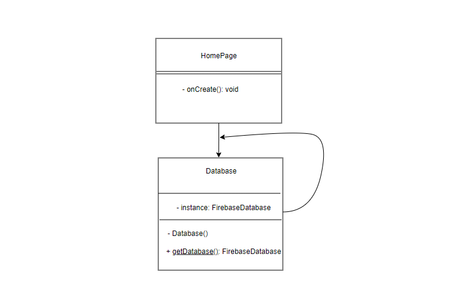

**2.State**

* *Objective*:  used for **retrieve the current user's login status** from [GlobalVariables](https://gitlab.cecs.anu.edu.au/u7706423/gp-24s1/-/blob/main/src/app/src/main/java/com/example/myapplication/basicClass/GlobalVariables.java#L42-65) to dynamically control the visibility of UI elements and enforce corresponding functional restrictions. 

* *Code Locations*
  * defined in  [UserState.java](https://gitlab.cecs.anu.edu.au/u7706423/gp-24s1/-/blob/main/src/app/src/main/java/com/example/myapplication/basicClass/UserState.java), [UserLoggedInState.java](https://gitlab.cecs.anu.edu.au/u7706423/gp-24s1/-/blob/main/src/app/src/main/java/com/example/myapplication/basicClass/UserLoggedInState.java), [UserLoggedOutState.java](https://gitlab.cecs.anu.edu.au/u7706423/gp-24s1/-/blob/main/src/app/src/main/java/com/example/myapplication/basicClass/UserLoggedOutState.java)
  * processed using in [GlobalVariables.java](https://gitlab.cecs.anu.edu.au/u7706423/gp-24s1/-/blob/main/src/app/src/main/java/com/example/myapplication/basicClass/GlobalVariables.java#L42-65), [CommonHelper.refreshLoginUser()](https://gitlab.cecs.anu.edu.au/u7706423/gp-24s1/-/blob/main/src/app/src/main/java/com/example/myapplication/common/CommonHelper.java?#L94-95), [HomePage.Logout](https://gitlab.cecs.anu.edu.au/u7706423/gp-24s1/-/blob/main/src/app/src/main/java/com/example/myapplication/Activities/HomePage.java?#L141-142), [HomePage.initLoginUser()](https://gitlab.cecs.anu.edu.au/u7706423/gp-24s1/-/blob/main/src/app/src/main/java/com/example/myapplication/Activities/HomePage.java?#L211-212), [UserDetailPage.updateUserInfo()](https://gitlab.cecs.anu.edu.au/u7706423/gp-24s1/-/blob/main/src/app/src/main/java/com/example/myapplication/Activities/UserDetailPage.java#L193-194)
* *Reasons*
  * <u>UI elements and functional restrictions can change dynamically</u> based on the user's login status, improving user experience and responsiveness.
  * Easily <u>**adapt to changes and new requirements**</u> without affecting the entire codebase.
  
  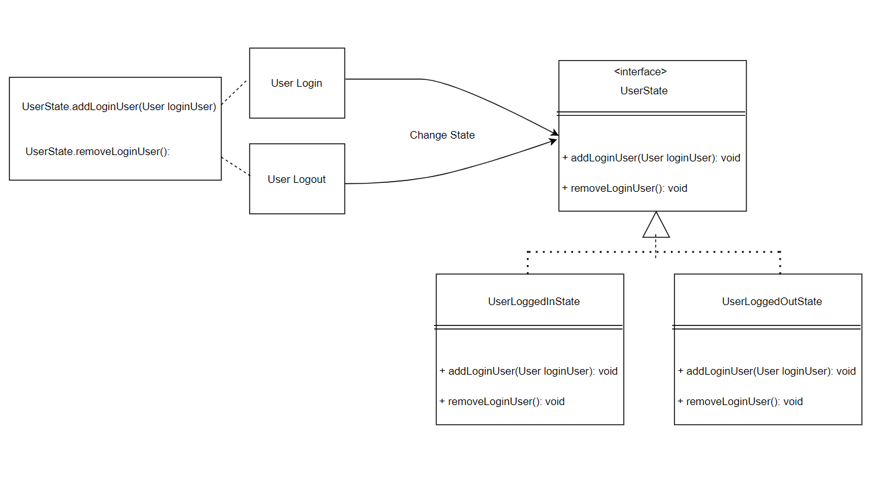

**3.Factory Method**

* *Objective*: used for **generating different notices** and store them into different database reference in factory 
* *Code Locations*
  
  * defined in [Notice.java](https://gitlab.cecs.anu.edu.au/u7706423/gp-24s1/-/blob/main/src/app/src/main/java/com/example/myapplication/basicClass/Notice.java), [NoticeFactory.java](https://gitlab.cecs.anu.edu.au/u7706423/gp-24s1/-/blob/main/src/app/src/main/java/com/example/myapplication/basicClass/NoticeFactory.java) , [UserNotice.java](https://gitlab.cecs.anu.edu.au/u7706423/gp-24s1/-/blob/main/src/app/src/main/java/com/example/myapplication/basicClass/UserNotice.java), [FavoriteNotice.java](https://gitlab.cecs.anu.edu.au/u7706423/gp-24s1/-/blob/main/src/app/src/main/java/com/example/myapplication/basicClass/FavoriteNotice.java)
  * processed using in [ProductPage.toggleFavoriteStatus()](https://gitlab.cecs.anu.edu.au/u7706423/gp-24s1/-/blob/main/src/app/src/main/java/com/example/myapplication/Activities/ProductPage.java#L220-222), [UserDetailPage.updateUserInfo()](https://gitlab.cecs.anu.edu.au/u7706423/gp-24s1/-/blob/main/src/app/src/main/java/com/example/myapplication/Activities/UserDetailPage.java#L187-189)
* *Reasons*
  
  *  <u>Easy addition of new notice types</u> without modifying existing code. 
  *  <u>Relying on factory interfaces instead of concrete classes</u>, it fosters a modular and loosely coupled design, facilitating system maintenance and evolution.
  
  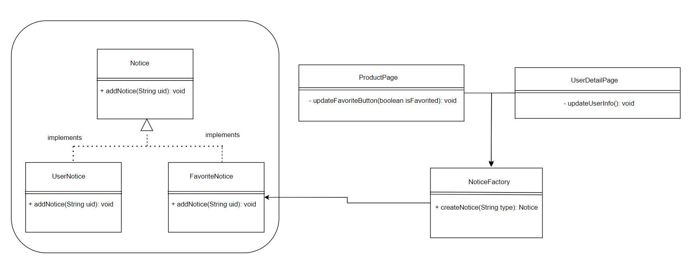

<hr>

### Parser

### <u>Grammar(s)</u>
Basically my grammar is for tracking `keywords` of the user input, it's made of different filters combine with each other.
The **advantage** of doing this is this way is easier to modify in the future if we want to improve the grammar, and also it's
very powerful and easy to implement.

Production Rules:

    <query> ::= <location-filter> <category-filter> <name-filter>
    <location-filter> ::= 'LOCATION' <string> | ε
    <category-filter> ::= 'CATEGORY' <string> | ε
    <name-filter> ::= 'NAME' <string> | ε
    <string> ::= [a-zA-Z0-9]+

### <u>Tokenizers and Parsers</u>

`Tokenizer`

- code: [Tokenizer.java](https://gitlab.cecs.anu.edu.au/u7706423/gp-24s1/-/blob/main/src/app/src/main/java/com/example/myapplication/basicClass/Tokenizer.java?),[Token.java](https://gitlab.cecs.anu.edu.au/u7706423/gp-24s1/-/blob/main/src/app/src/main/java/com/example/myapplication/basicClass/Token.java?ref_type=heads)

- feature: The user input will be converted to different kinds of Tokens, this will help Parser.

- implementation: After we get the input from user, it will be converted into following Tokens; **LOCATION, CATEGORY, NAME and IGNORE**. The basic idea is to track the keyword, Every single type of token will have a checklist, after correct the typo of user input, if the key word is contained by one of the checklist, it will become that type of Token. If the key word doesn't contain by any of the checklist, it will become NAME.

`Parser`

- code: [Parser.java](https://gitlab.cecs.anu.edu.au/u7706423/gp-24s1/-/blob/main/src/app/src/main/java/com/example/myapplication/basicClass/Parser.java)


- feature: The search result will be provided, and it will be store in an `AVLtree`.


- implementation: Once will have the user input, the Tokenizer will convert it into Tokens, then the Parser will use Tokens to clip the `AVLtree`. When we create a parser, it will 
  generate three query base on the user input, the first time it will go through location query, then clip `AVLtree`, after that, it will go through the `Category query` and `Name query`. If the Token type is IGNORE, we will do nothing, just ignore it.

<hr>

## Implemented Features
### Basic Features
1. [LogIn] Users must be able to log in (not necessarily sign up). (easy)
   * Code: [LoginPage.java](https://gitlab.cecs.anu.edu.au/u7706423/gp-24s1/-/blob/main/src/app/src/main/java/com/example/myapplication/Activities/LoginPage.java)
   * Feature: Users need to <u>input their email and password for authentication</u>. If the credentials are correct, they will be directed to the `HomePage`.
   * Implementation: On the login screen, <u>enter your email address and password</u>, then call `FirebaseAuth.signInWithEmailAndPassword` to <u>authenticate the user</u>. If authentication is successful, you will be <u>redirected</u> to the `HomePage`; if it fails, a login failure message will be displayed.
2. [DataFiles] Create a dataset with at least 2,500 valid data instances, each representing a meaningful piece of information in your app. The data should be represented and stored in a structured format taught in the course. (easy)
   * Code to the Data File [user_data_0513.json](https://gitlab.cecs.anu.edu.au/u7706423/gp-24s1/-/blob/main/src/app/src/main/assets/user_data_0513.json), [product_data.json](https://gitlab.cecs.anu.edu.au/u7706423/gp-24s1/-/blob/main/src/app/src/main/assets/product_data.json)
   * Link to the Firebase repo: [Second Hand Market-Twice Treasured](https://console.firebase.google.com/project/second-hand-market-affd5/overview)
3. [LoadShowData] Load and display data instances from your dataset. Choose an appropriate format to present the different types of data. (easy) 
   - Code:[initLoginUser()](https://gitlab.cecs.anu.edu.au/u7706423/gp-24s1/-/blob/main/src/app/src/main/java/com/example/myapplication/Activities/HomePage.java?#L189-229)
   - Feature: Load and display current User Information
   - Implementation:  Base on user's email, query and retrieve data from firebase, update `GlobalVariables.LoginUser` and textView value accordingly.
4. [DataStream] Create data instances to simulate users’ actions and interactions, which are then used to feed the app so that when a user is logged in, these data are loaded at regular time intervals and visualized on the app. (medium)
   - Code: [updateUserInfo()](https://gitlab.cecs.anu.edu.au/u7706423/gp-24s1/-/blob/main/src/app/src/main/java/com/example/myapplication/Activities/UserDetailPage.java#L176-205)
   - Feature: Update current User information
   - Implementation: Retrieve user data reference from firebase, call `setValue` to change value. If password changes, call `FirebaseAuth.updatePassword` change user authentication identification.
5. [Search] Users must be able to search for information on your app. (medium) 
   - Code: [findProduct()](https://gitlab.cecs.anu.edu.au/u7706423/gp-24s1/-/blob/main/src/app/src/main/java/com/example/myapplication/Activities/SearchService.java?ref_type=heads), [Parser.java](https://gitlab.cecs.anu.edu.au/u7706423/gp-24s1/-/blob/main/src/app/src/main/java/com/example/myapplication/basicClass/Parser.java), [Tokenizer.java](https://gitlab.cecs.anu.edu.au/u7706423/gp-24s1/-/blob/main/src/app/src/main/java/com/example/myapplication/basicClass/Tokenizer.java?ref_type=heads), [Token.java](https://gitlab.cecs.anu.edu.au/u7706423/gp-24s1/-/blob/main/src/app/src/main/java/com/example/myapplication/basicClass/Token.java?ref_type=heads)
   - Feature: Track user's input, then display the result from the database.
   - Implementation: Use `findProduct()` to track user's input, then deal with the input with parser, the parser, the Tokenizer and Tokens will help parser to provide an `AVLtree `which contains the result.

### Custom Features

| Feature ID | Feature                                             | Criteria |
| :--------: | --------------------------------------------------- | -------- |
|                                      | **Search-related features** ||
| 1          | Search-Invalid                                      | medium   |
| 2          | Search-Filter                                       | easy     |
|            | **UI Design and Testing**                           |          |
| 1          | UI-Layout                                           | easy     |
|            | **Greater Data Usage, Handling and Sophistication** |          |
| 2          | Data-Profile                                        | easy     |
| 3          | Data-GPS                                            | easy     |
| 5          | Data-Deletion                                       | medium   |
|            | **Firebase Integration**                            |          |
| 1          | FB-Auth                                             | easy     |
| 2          | FB-Persist-extension                               | hard |
|            | **Peer to Peer Messaging**                          |          |
| 1          | P2P-DM                                              | hard     |
|            | **User Interactivity**                              |          |
| 1 | Interact-Micro | easy |
| 2          | Interact-Follow                                     | medium   |
| 4          | Interact-Noti                                       | medium   |
|            | **Privacy**                                         |          |
| 2          | Privacy-Visibility                                  | easy     |

**Search-related features** 

1. [Search-Invalid] On top of giving search results from valid inputs, search functionality can process and 	correctly handle partially invalid search queries and give meaningful results. <u>(medium)</u> 
   - Code: [checkNameTypo()](https://gitlab.cecs.anu.edu.au/u7706423/gp-24s1/-/blob/main/src/app/src/main/java/com/example/myapplication/basicClass/Parser.java?ref_type=heads), [checkTypo()](https://gitlab.cecs.anu.edu.au/u7706423/gp-24s1/-/blob/main/src/app/src/main/java/com/example/myapplication/basicClass/Tokenizer.java?ref_type=heads), [checkMiss()](https://gitlab.cecs.anu.edu.au/u7706423/gp-24s1/-/blob/main/src/app/src/main/java/com/example/myapplication/basicClass/Tokenizer.java?ref_type=heads), [checkTypoWithMiss()](https://gitlab.cecs.anu.edu.au/u7706423/gp-24s1/-/blob/main/src/app/src/main/java/com/example/myapplication/basicClass/Tokenizer.java?ref_type=heads), [checkDuplicate()](https://gitlab.cecs.anu.edu.au/u7706423/gp-24s1/-/blob/main/src/app/src/main/java/com/example/myapplication/basicClass/Tokenizer.java?ref_type=heads),
   - Implementation: Once we get the user input, we will track key words and transfer them to each different type of token. During the processing, these functions will check if it's a typo or not, then it will correct it.
2. [Search-Filter] Sort and filter a list of items returned from searches, with the use of suitable UI 
   components. <u>(easy)</u> 
   - Code: 
     - [FindNewProduct()](https://gitlab.cecs.anu.edu.au/u7706423/gp-24s1/-/blob/main/src/app/src/main/java/com/example/myapplication/Activities/SearchService.java#L51-57)
     - [FindUsedProduct()]((https://gitlab.cecs.anu.edu.au/u7706423/gp-24s1/-/blob/main/src/app/src/main/java/com/example/myapplication/Activities/SearchService.java#L59-65))
     - [FindProductsAscendingOrder()](https://gitlab.cecs.anu.edu.au/u7706423/gp-24s1/-/blob/main/src/app/src/main/java/com/example/myapplication/Activities/SearchService.java#L108-115)
     - [FindProductsDescendingOrde()](https://gitlab.cecs.anu.edu.au/u7706423/gp-24s1/-/blob/main/src/app/src/main/java/com/example/myapplication/Activities/SearchService.java#L117-124)
   - Implementation: Use `AVLTree's inOrderTraversalAscending` and `inOrderTraversalDescending ` to sort the prices of items in ascending/descending order. For condition filtering, the product is added to the AVL tree only when the product instance is not null and the product's condition is New/Used.

**UI Design and Testing** 

​	1.[UI-Layout]. Incorporate suitable layout adjustments in the UI components for portrait and landscape 	layout variants, as well as different screen sizes. <u>(easy)</u> 
- Code: [HomePageLayout](https://gitlab.cecs.anu.edu.au/u7706423/gp-24s1/-/blob/main/src/app/src/main/res/layout/activity_home_page.xml)
- Implementation: Arrange the layout with <u>a Top bar, Content, and Bottom bar</u> within a `RelativeLayout` . The Top bar's contents are set within a `ConstraintLayout `for precise alignment, while the Content resides in a `ScrollView`, enabling seamless scrolling. Lastly, the Bottom bar is nested within a `LinearLayout`, ensuring its placement at the absolute bottom using *layout_alignParentBottom*.

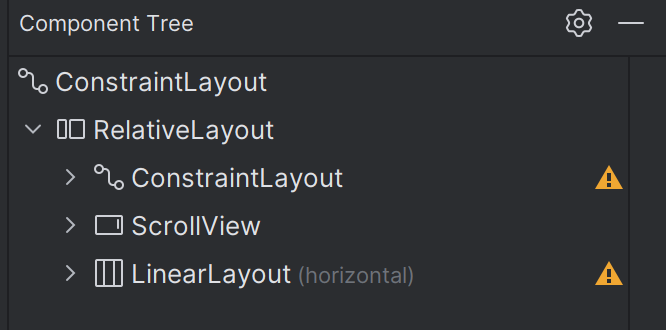


*Note: majority of pages adhere to this framework; here, we're simply using the homepage layout as an illustrative example.*

**Greater Data Usage, Handling and Sophistication** 

2.[Data-Profile]. Create a Profile Page for Users or any Entities, which contains a media file.<u>(easy)</u>

- Code: [UserDetailPage.java](https://gitlab.cecs.anu.edu.au/u7706423/gp-24s1/-/blob/main/src/app/src/main/java/com/example/myapplication/Activities/UserDetailPage.java)
- Implementation: Transition from `UserPage `to Profile, then to `UserPageDetailPage`. On the `UserPageDetailPage`, seamlessly load all details of the logged-in user. Users can effortlessly modify their <u>avatar, name, location, and password</u>, then *double-check alert shows*, after user confirms, system will store new data into database. After successfully changing the password, <u>prompt the user to log in again for security.</u>

3.[Data-GPS] Use GPS information based on location data in your App. <u>(easy)</u> 

- Code: [getLocation()](https://gitlab.cecs.anu.edu.au/u7706423/gp-24s1/-/blob/main/src/app/src/main/java/com/example/myapplication/Activities/UserDetailPage.java?#L285-331)
- Implementation: Add location permission to `AndroidManifest.xml`. Upon user approval, create a location service client to <u>fetch last known location</u>. Convert the location to a city name and display it in a TextView.

5.[Data-Deletion] Implement Deletion for your chosen tree data structure, and the deletion must serve 
a purpose within your application. <u>(medium)</u> 

- Code:[AVLTree.java](https://gitlab.cecs.anu.edu.au/u7706423/gp-24s1/-/blob/main/src/app/src/main/java/com/example/myapplication/common/AVLTree.java?ref_type=heads),[AVLNode.java](https://gitlab.cecs.anu.edu.au/u7706423/gp-24s1/-/blob/main/src/app/src/main/java/com/example/myapplication/common/AVLNode.java?ref_type=heads)
- Implementation: We decide to use `AVLtree `and compare the production by price, the reason is that it will be efficient to do the filter. Every times the user  search 	something, the application will put the product into the `avltree`, then use parser to "clip" the `avltree ` to get the result. Then after that, user can user the filter to show the 	production with a certain sequence without reloading the database again, this will increate the efficiency significantly.

**Firebase Integration**

1.[FB-Auth] Use Firebase to implement User Authentication/Authorisation. <u>(easy)</u> 

- Code: [loginUser()](https://gitlab.cecs.anu.edu.au/u7706423/gp-24s1/-/blob/main/src/app/src/main/java/com/example/myapplication/Activities/LoginPage.java?#L86-104), [registerUser()](https://gitlab.cecs.anu.edu.au/u7706423/gp-24s1/-/blob/main/src/app/src/main/java/com/example/myapplication/Activities/RegisterActivity.java?#L85-118), [updateUserInfo()](https://gitlab.cecs.anu.edu.au/u7706423/gp-24s1/-/blob/main/src/app/src/main/java/com/example/myapplication/Activities/UserDetailPage.java?#L183)
- Implementation: Use `FirebaseAuth.createUserWithEmailAndPassword` to <u>create a user</u>, `FirebaseAuth.signInWithEmailAndPassword` to <u>authenticate the user</u>, and `FirebaseAuth.updatePassword` to <u>change the user's password</u>.

2.[FB-Persist-extension]] Use Firebase to persist all data used in your app. <u>(medium)</u> 

- Code: [refreshLoginUser()](https://gitlab.cecs.anu.edu.au/u7706423/gp-24s1/-/blob/main/src/app/src/main/java/com/example/myapplication/common/CommonHelper.java?#L94-95),[updateUserInfo](https://gitlab.cecs.anu.edu.au/u7706423/gp-24s1/-/blob/main/src/app/src/main/java/com/example/myapplication/Activities/UserDetailPage.java#L187-189)
- Implementation: Implement a listener that triggers subsequent actions once data updates are completed.

**Peer to Peer Messaging**

1.[P2P-DM] Provide users with the ability to message each other directly in private. <u>(hard)</u> 

- Code: [PrivateChat.java](https://gitlab.cecs.anu.edu.au/u7706423/gp-24s1/-/blob/main/src/app/src/main/java/com/example/myapplication/Activities/PrivateChat.java?ref_type=heads), [MessageAdapter.java](https://gitlab.cecs.anu.edu.au/u7706423/gp-24s1/-/blob/main/src/app/src/main/java/com/example/myapplication/Adapters/MessageAdapter.java?ref_type=heads), [PrivateMenuActivity.java](https://gitlab.cecs.anu.edu.au/u7706423/gp-24s1/-/blob/main/src/app/src/main/java/com/example/myapplication/Activities/PrivateMenuActivity.java?ref_type=heads), [ChatMenuAdapter.java](https://gitlab.cecs.anu.edu.au/u7706423/gp-24s1/-/blob/main/src/app/src/main/java/com/example/myapplication/Adapters/ChatMenuAdapter.java?ref_type=heads), [MesageBuble.java](https://gitlab.cecs.anu.edu.au/u7706423/gp-24s1/-/blob/main/src/app/src/main/java/com/example/myapplication/basicClass/MessageBuble.java?ref_type=heads), [MessageEnvironment.java](https://gitlab.cecs.anu.edu.au/u7706423/gp-24s1/-/blob/main/src/app/src/main/java/com/example/myapplication/basicClass/MessageEnvironment.java?ref_type=heads). [ProductPage: lines 67-81,chatWithSellerBtn.setOnClickListener()](https://gitlab.cecs.anu.edu.au/u7706423/gp-24s1/-/blob/main/src/app/src/main/java/com/example/myapplication/Activities/ProductPage.java?#L67-L81)

- Implementation: A user can start a `PrivateChat ` Activity via the `chatWithSellerBtn.setOnClickListener() ` in the `ProductPage ` Activity. On creating the activity, `openNewOrExistingEnvironment()` pulls a message environment from Firebase if one exists for the two users, or creates a new message environment. A recycler is used to display the messages between the two users. `buttonSend.setOnClickListener() ` allows the user to send a message to Firebase. If it is the first message sent in the environment, the environment id is added to each user in Firebase using `addMessageIdToUsers()`.` environmentRef.addValueEventListener()` is used to update the `messageEnvironment `and recycler to synchronously as the Firebase reference is updated and allows users to see messages instantly.

  

  `PrivateMenuActivity ` users a recycler to display who the user has been chatting with and allows the user to open up the corresponding `PrivateChat ` Activity. A `ValueEventListener ` is used to update the recycler when a message id is added to the user in Firebase. This means the user can instantly see when a new `messageEnvironment ` is assigned to them.

**User Interactivity**

1.[Interact-Micro] The ability to micro-interact with items/users (e.g. like, block, connect to another 
user, etc.) [stored in-memory]. <u>(easy)</u> 

- Code: [ProductPage.java](https://gitlab.cecs.anu.edu.au/u7706423/gp-24s1/-/blob/main/src/app/src/main/java/com/example/myapplication/Activities/ProductPage.java?ref_type=heads#L161-229)
- Implementation:In `ProductPage.java`, the favorite feature is implemented using `checkFavoriteStatus` and `toggleFavoriteStatus`. `checkFavoriteStatus` checks if the user has favorited the product and updates the button state. When the button is clicked, `toggleFavoriteStatus` adds or removes the favorite and updates the button state accordingly.

2.[Interact-Follow] The ability to ‘follow’ items. There must be a section that presents all the items 
followed by a user, grouped, and ordered. [stored in-memory] <u>(medium)</u> 

- Code:[Favorite.java](https://gitlab.cecs.anu.edu.au/u7706423/gp-24s1/-/blob/main/src/app/src/main/java/com/example/myapplication/basicClass/Favorite.java?ref_type=heads#L1-61) [FavoriteAdapter.java](https://gitlab.cecs.anu.edu.au/u7706423/gp-24s1/-/blob/main/src/app/src/main/java/com/example/myapplication/Adapters/FavoriteAdapter.java?ref_type=heads#L1-274)[FavoritePage.java](https://gitlab.cecs.anu.edu.au/u7706423/gp-24s1/-/blob/main/src/app/src/main/java/com/example/myapplication/Activities/FavoritePage.java?ref_type=heads#L1-347)[IntroPage.java](https://gitlab.cecs.anu.edu.au/u7706423/gp-24s1/-/blob/426017bae89d609e9e99b822e2c032ee09310a88/src/app/src/main/java/com/example/myapplication/Activities/IntroPage.java#L27-29)
- Implementation:The products collected by users are all displayed on the favorite page, and the products can be viewed in categories and sorted in ascending or descending order according to price.

4.[Interact-Noti] The ability to send notifications for interactions (e.g., follow request, product viewed, 
etc.). A notification must be sent only after a predetermined number of interactions are set [e.g., 
when ≥2 requests have been received or 2 follow requests have been received). <u>(medium)</u> 

- Code: [Notice.java](https://gitlab.cecs.anu.edu.au/u7706423/gp-24s1/-/blob/main/src/app/src/main/java/com/example/myapplication/basicClass/Notice.java), [NoticeFactory.java](https://gitlab.cecs.anu.edu.au/u7706423/gp-24s1/-/blob/main/src/app/src/main/java/com/example/myapplication/basicClass/NoticeFactory.java) , [UserNotice.java](https://gitlab.cecs.anu.edu.au/u7706423/gp-24s1/-/blob/main/src/app/src/main/java/com/example/myapplication/basicClass/UserNotice.java), [FavoriteNotice.java](https://gitlab.cecs.anu.edu.au/u7706423/gp-24s1/-/blob/main/src/app/src/main/java/com/example/myapplication/basicClass/FavoriteNotice.java)
- Implementation:  <u>Generate different notices</u> and store them into different database reference by using <u>Factory Method</u>. The `UserNotice `used for password changing, `FavoriteNotice `used for user's product favorites number >=2.

**Privacy**

2.[Privacy-Visibility] Given there are at least two types of visibility (public, private, ...), users can only 
see some profiles or contents that are set to Public or after request being accepted <u>(easy)</u>. 

- Code:  [UserState.java](https://gitlab.cecs.anu.edu.au/u7706423/gp-24s1/-/blob/main/src/app/src/main/java/com/example/myapplication/basicClass/UserState.java), [UserLoggedInState.java](https://gitlab.cecs.anu.edu.au/u7706423/gp-24s1/-/blob/main/src/app/src/main/java/com/example/myapplication/basicClass/UserLoggedInState.java), [UserLoggedOutState.java](https://gitlab.cecs.anu.edu.au/u7706423/gp-24s1/-/blob/main/src/app/src/main/java/com/example/myapplication/basicClass/UserLoggedOutState.java)
- Implementation: <u>Using State</u>, create different user states to control access to the application. Based on the current state, users who log in successfully will <u>have access to all features and the complete UI</u>. Visitors who choose to skip login will <u>have limited access</u>, allowing them only to use the search features and the login function.


<hr>

### Surprise Features

**1.Database Connection Instance**

***Description***

| Commits                                                      | files     | line number | Publish Date   |
| ------------------------------------------------------------ | --------- | ----------- | -------------- |
| [Code Smell](https://gitlab.cecs.anu.edu.au/u7706423/gp-24s1/-/blob/f69db3f401c8202624973dfd2310c74589b4f51c/src/app/src/main/java/com/example/myapplication/Activities/Page.java#L17-19) | Page.java | L17-19      | April 22, 2024 |

```
FirebaseDatabase database = FirebaseDatabase.getInstance();
```

Create a database instance in abstract Page class, all class who extends it can use the database instance,  to store and retrieve data directly.

***Reasons to remove it***

- Classes only extends Page class can access database instance, **limit the reusability**.
- Page class is responsible not only for displaying and interacting with UI, but also for managing the database instance, the burden is too heavy, **reducing code maintainability**.
- Tight coupling between classes can result in unexpected problems, for example, if there is a need to modify or replace the database instance, it will affect Page class and its all subclasses, **reducing the flexibility**.

***Implementation Description***

| Commits                                                      | files         | line number | Publish Date |
| ------------------------------------------------------------ | ------------- | ----------- | ------------ |
| [Singleton Database Instance](https://gitlab.cecs.anu.edu.au/u7706423/gp-24s1/-/blob/add8ef59cdd6ad5e755540cf858772472603a139/src/app/src/main/java/com/example/myapplication/basicClass/Database.java#L5-22) | Database.java | L5-22       | May 3, 2024  |

```java
private static FirebaseDatabase database = null;
    private Database() {

    }
    public static FirebaseDatabase getDatabase(){
        if(database == null){
            database = FirebaseDatabase.getInstance();
        }else{
            System.out.println("Database instance has been created yet.");
        }

        return database;
    }
```

Create a Databse.java, and create only one database instance throughout the lifecycle using the **singleton pattern**.

***Reason to use it***

- Using the Singleton Pattern ensures there is **only one database instance** throughout the application lifecycle, thereby conserving resources and enhancing code performance due to reduced overhead associated with creating and destroying duplicate database instances.
- All activities accessing the database through this single instance, **reliability and consistency** are ensured, while the risk of data synchronization and management issues is mitigated.
- Separating the database instance into its own class reduces coupling between classes. This separation allows for easier modifications to the database implementation without affecting other parts of the application.


**2.Bottoom Navigation Bar**

***Description***

| Commits                                                      | files                  | line number | Publish Date   |
| ------------------------------------------------------------ | ---------------------- | ----------- | -------------- |
| [Code Smell](https://gitlab.cecs.anu.edu.au/u7706423/gp-24s1/-/blob/d7fe72c6a317fe1253d70bbaa54119ca03e7be4c/src/app/src/main/res/layout/activity_home_page.xml#L204-241) | activity_home_page.xml | L204-241    | April 21, 2024 |

Four TextViews are arranged side by side at the bottom of the ConstraintLayout, with each TextView constrained to the left and right of the others, creating a Navigation Bar.

***Reasons to remove it***

- When adjusting the screen size on a mobile device, the Bottom Navigation **fails to remain fixed at the bottom**, thus preventing content from adapting automatically.
- The bottom navigation's visual design appears rough, and there's a lack of clear indication when switching tabs, resulting in a **subpar user experience**.

***Implementation Description***

| Commits                                                      | files                  | line number | Publish Date |
| ------------------------------------------------------------ | ---------------------- | ----------- | ------------ |
| [Fix Navigation Bar](https://gitlab.cecs.anu.edu.au/u7706423/gp-24s1/-/blob/3800a353c4e665822ccb4bc1f55cedfcd7228e92/src/app/src/main/res/layout/activity_home_page.xml#L297-357) | activity_home_page.xml | L297-357    | May 1, 2024  |
| [Button Clicked change appearance](https://gitlab.cecs.anu.edu.au/u7706423/gp-24s1/-/blob/e9c0bd0258863f9dd21d6f7038fa977576930f84/src/app/src/main/res/layout/activity_home_page.xml#L336-448) | activity_home_page.xml | L336-448    | May 3, 2024  |

- Using a **RelativeLayout** instead of a ConstraintLayout. Within the RelativeLayout, place four TextViews in a **LinearLayout**, setting the LinearLayout's attribute **android:layout_alignParentBottom="true"** to ensure it remains at the bottom of the layout. 
- Button Icon image changes when buttons in the bottom navigation bar are clicked or unclicked. 

***Reason to use it***

- Guarantee that both the bottom and top bars **maintain their correct positions** regardless of any changes in screen size.
- Ensures that customers can easily discern between clicked and unclicked buttons, **improving the overall user experience**.


**3.Product Constructor**

***Description***

| Commits                                                      | files           | line number | Publish Date |
| ------------------------------------------------------------ | --------------- | ----------- | ------------ |
| [Code Smell](https://gitlab.cecs.anu.edu.au/u7706423/gp-24s1/-/commit/0bb5a6e5180cba7e97d25bfbdd0f348c9b5c7ff2) | Production.java | L3-25       |              |

***Reasons to improve it***

- This production constructor did have the variable it needs, but it can't be put into the AVLtree because the `AVLtree ` doesn't know how to compare between Product.
- In our logic, we will check if two Product are the same to avoid duplicate result, but this constructor can't do that.

***Implementation Description***

| Commits                                                      | files        | line number   | Publish Date |
| ------------------------------------------------------------ | ------------ | ------------- | ------------ |
| [Make the product comparable](https://gitlab.cecs.anu.edu.au/u7706423/gp-24s1/-/commit/7ece647a07536bbc9546bd8d71a7124d47999037) | Product.java | L4, L117-L120 | May 2, 2024  |
| [Rewrite the hashcode for product, avoid duplicate with name checking.](https://gitlab.cecs.anu.edu.au/u7706423/gp-24s1/-/commit/16ed68a179ca535356118ad60e2184856d9ff7ce) | Product.java | L143-149      | May 13, 2024 |

- Make Product comparable, compare by price.
- Rewrite the `hashcode `for Product based on its ID. 

***Reason to use it***

- We need to put Product in to the `AVLTree`, but we need to rewrite the compare to the `AVLTree `knows how to compare it.
- We have somewhere to check duplicate for search result, we need to write the `hashcode ` for this.


**4.Product PostPage**

***Description***

| Commits                                                      | files              | line number | Publish Date   |
| ------------------------------------------------------------ | ------------------ | ----------- | -------------- |
| [Code Smell](https://gitlab.cecs.anu.edu.au/u7706423/gp-24s1/-/commit/ea0ced846c4a489fa9ed988ff6a158e590fb40e2) | TradePlatform.java | L38-45      | April 23, 2024 |

***Reasons to improve it***

- When users post a new product, they should not use `EditText ` to manually enter the category or condition of the product, but there should be a drop-down selection bar for the user to choose directly.
- The user uses the drop-down selection bar to enter the category of the product, which is helpful for later implementing the category-based product search function.

***Implementation Description***

| Commits                                                      | files     | line number    | Publish Date |
| ------------------------------------------------------------ | --------- | -------------- | ------------ |
| [Change the input method of Category in Post to drop-down selection](https://gitlab.cecs.anu.edu.au/u7706423/gp-24s1/-/commit/bbb625e17ad77fe900c409d154861d6e60afb309) | Post.java | L58-66         | May 1, 2024  |
| [Add Product Condition drop-down selection to PostPage.](https://gitlab.cecs.anu.edu.au/u7706423/gp-24s1/-/commit/786461ffb69e5e24598e7305546c78493c32fd23) | Post.java | L51-52,L68-101 | May 1, 2024  |

Allow users to use the selection drop-down bar to enter the category and condition of the product.


***Reason to use it***

- When users post new products, select the following categories: Electronics, Clothing, Furniture, Books, Sports, Toys, Beauty, Others. After uploading, users can select the icon corresponding to the category in `HomePage `to search for products.
- When the user uploads, the condition of the product is selected as New or Used. Users can then filter New or Used in the Search-Filter function.


**5.Product Constructor**

***Description***

| Commits                                                      | files           | line number | Publish Date   |
| ------------------------------------------------------------ | --------------- | ----------- | -------------- |
| [Code Smell](https://gitlab.cecs.anu.edu.au/u7706423/gp-24s1/-/commit/0bb5a6e5180cba7e97d25bfbdd0f348c9b5c7ff2) | Production.java | L3-25       | April 22, 2024 |

***The reason for smelly***

- In Product constructor we have `categoryID`, but we never use it.

***Why we haven't remove it***

- We already set up our database and put 2500 pieces of data in it before we found this smelly code, and also there were too many code relate to this constructor, so we can't change it.


## Summary of Known Errors and Bugs

**Bugs**

1. *Bug 1:* Due to <u>asynchronous database data retrieval</u>, if a user navigates to the `HomePage ` and clicks on the bottom navigation bar before `initLoginUser() `finishes, the system might incorrectly assume they are not logged in.<u>(fixed by add a loading overlay or dialog to wait for `initLoginUser ` to finish.)</u>

**Errors**

1. Error 1: In case of <u>slow internet connection</u>, <u>timeout errors</u> may occur while retrieving GPS coordinates, preventing the current location from being obtained.


## Testing Summary

 **Overall Coverage Summary**

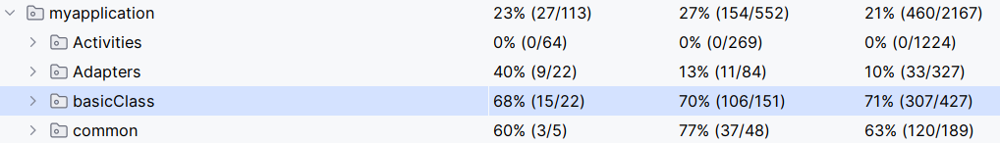

Although the data in the graph shows that the test coverage has not reached the minimum requirement of 70%, the actual unit test coverage is 100% when excluding special cases such as UI interaction classes and database interaction classes. See the introduction below for details.

The unit tests mainly cover the basic class and common packages, with details as follows:

**Package: basic class**

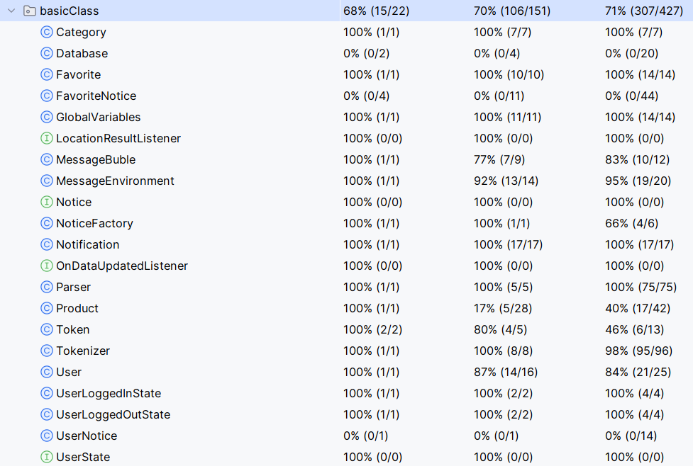

- Unit tests cover 18 out of 21 classes in the basic class package.
- The remaining 3 classes interact with the Firebase database, making them unsuitable for unit tests, resulting in a class test coverage of 0% for these classes.
- Excluding these three exceptional cases, the actual class-level unit test coverage for the basic class package is 100%.


**Package: common**

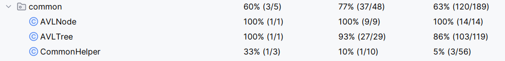

- This package includes 3 classes.

- Due to the interaction with the Firebase database in the `CommonHelper` class, the unit tests did not cover all of its code.

- Excluding the special case of this class, the actual unit test coverage for the `common` package is 100%.

**Package: Activities, Adapters**

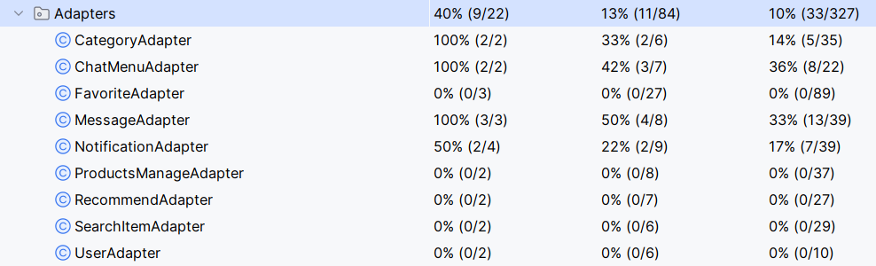

- Both packages involve UI interactions and are not suitable for unit testing.

- Therefore, only 4 out of 9 classes in the Adapters package were teste

  


## Team Management

### Meetings Records
* [Meeting-0415](https://gitlab.cecs.anu.edu.au/u7706423/gp-24s1/-/blob/main/items/meeting-0415.md?ref_type=heads)
  
* [Meeting-0416](https://gitlab.cecs.anu.edu.au/u7706423/gp-24s1/-/blob/main/items/meeting-0416.md?ref_type=heads)
  
* [Meeting-0423](https://gitlab.cecs.anu.edu.au/u7706423/gp-24s1/-/blob/main/items/meeting-0423.md?ref_type=heads)
  
* [Meeting-0429](https://gitlab.cecs.anu.edu.au/u7706423/gp-24s1/-/blob/main/items/meeting-0429.md?ref_type=heads)
  
* [Meeting-0506](https://gitlab.cecs.anu.edu.au/u7706423/gp-24s1/-/blob/main/items/meeting-0506.md?ref_type=heads)
  
* [Meeting-0514](https://gitlab.cecs.anu.edu.au/u7706423/gp-24s1/-/blob/main/items/meeting-0514.md?ref_type=heads)
  
  

<hr>

### Conflict Resolution Protocol
- If a member fails to meet the initial plan and/or deadlines, <u>others may need support. We should adjust the plan or allocate resources accordingly, and communicate with the team member to find a solution.</u>
- Our group would address issues through <u>open communication, active listening, collaboration, and consensus-building.</u>
- If a member gets sick, we'll <u>ensure they receive support</u> and may <u>redistribute tasks among the team or seek temporary assistance.</u> 
- If the problem is unclear, then we <u>will work together to define it,</u> focusing on specific issues rather than generalizations.
- If the conflict is resolved, then we will <u>schedule a follow-up meeting</u> to assess the outcome and ensure ongoing collaboration.
